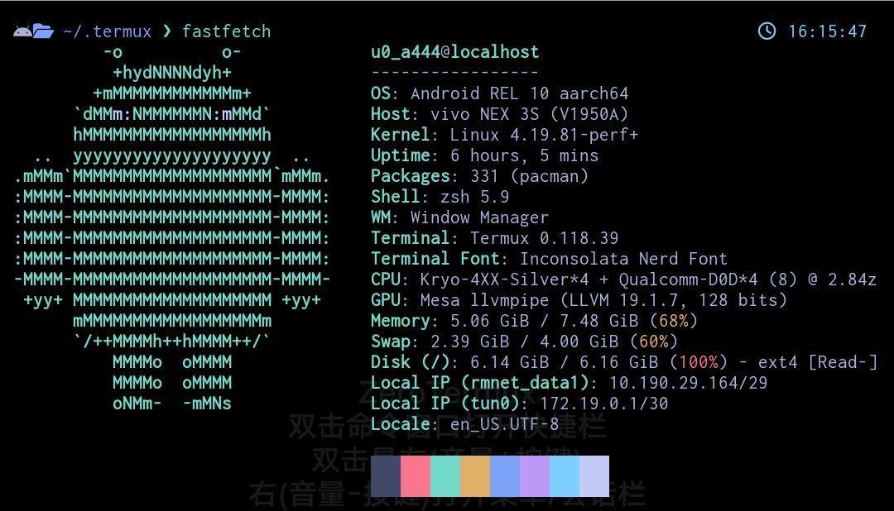

# Tokyo Night theme for Termux

A clean, dark [Termux](https://termux.dev/) color scheme that celebrates the lights of [Downtown Tokyo at night](https://www.google.com/search?q=tokyo+night&newwindow=1&sxsrf=ACYBGNRiOGCstG_Xohb8CgG5UGwBRpMIQg:1571032079139&source=lnms&tbm=isch&sa=X&ved=0ahUKEwiayIfIhpvlAhUGmuAKHbfRDaIQ_AUIEigB&biw=1280&bih=666&dpr=2).

Adapted from the original [Tokyo Night theme for Visual Studio Code](https://github.com/enkia/tokyo-night-vscode-theme) and [Tokyo Night theme for Kitty](https://github.com/davidmathers/tokyo-night-kitty-theme).

## Installation

1. Save the color scheme to `~/.termux/colors.properties`
2. Run `termux-reload-settings` to apply the theme

## Colors

```properties
color0=#414868
color1=#f7768e
color2=#73daca
color3=#e0af68
color4=#7aa2f7
color5=#bb9af7
color6=#7dcfff
color7=#c0caf5
color8=#414868
color9=#f7768e
color10=#73daca
color11=#e0af68
color12=#7aa2f7
color13=#bb9af7
color14=#7dcfff
color15=#c0caf5
background=#1a1b26
foreground=#a9b1d6
cursor=#c0caf5
```



## License

This theme is released under the MIT License.
