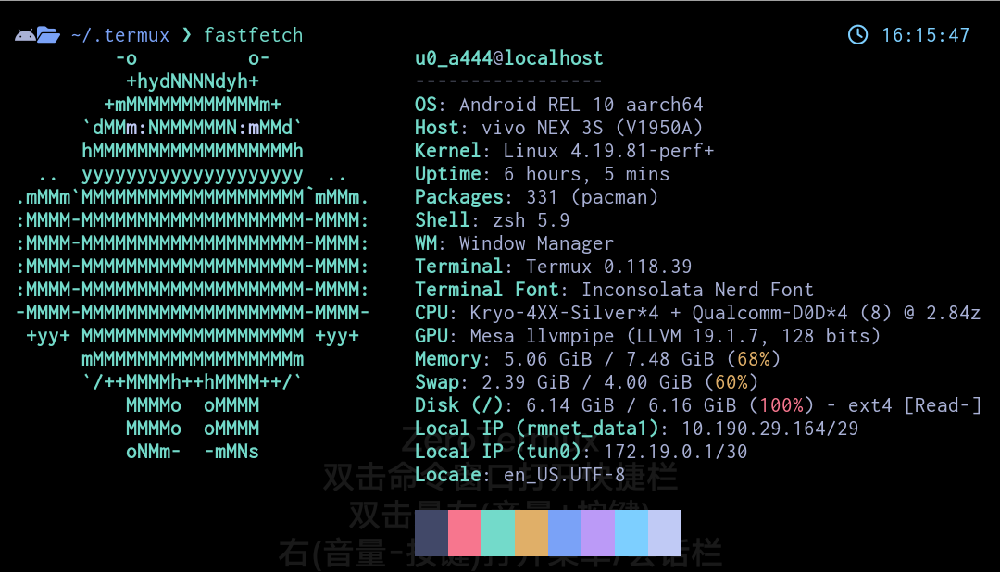

# Termux 專用的 Tokyo Night 主題
---
一款簡約深色風格的 [Termux](https://termux.dev/) 配色方案，靈感源自[東京都會區的夜間城市燈光](https://www.google.com/search?q=tokyo+night&newwindow=1&sxsrf=ACYBGNRiOGCstG_Xohb8CgG5UGwBRpMIQg:1571032079139&source=lnms&tbm=isch&sa=X&ved=0ahUKEwiayIfIhpvlAhUGmuAKHbfRDaIQ_AUIEigB&biw=1280&bih=666&dpr=2)。

改編自 [Visual Studio Code 的 Tokyo Night 主題](https://github.com/enkia/tokyo-night-vscode-theme) 與 [Kitty 終端機的 Tokyo Night 主題](https://github.com/davidmathers/tokyo-night-kitty-theme)原始版本。

## 安裝步驟

```bash
# 首先複製此儲存庫
$ git clone https://github.com/fywmjj/tokyo-night-termux-theme.git

# 切換至儲存庫工作目錄
$ cd tokyo-night-termux-theme/

# 授予安裝腳本「可執行」權限
$ chmod +x ./install.sh # 若無法執行，請嘗試加上「sudo」

# 執行腳本進行安裝
$ ./install.sh
```

## 預覽畫面



## 授權條款

本主題採用 MIT 授權條款釋出。